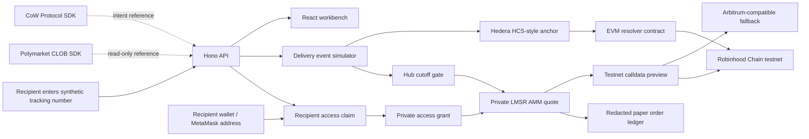

# Architecture



## Runtime Contract

- `/health` reports paper-only posture.
- `/api/tracking/:trackingNumber` returns shipment fixture, generated markets, cutoff status, and HCS-style anchors.
- `/api/access/policy/:trackingNumber` returns the recipient-only policy for a package.
- `/api/access/claim` creates a recipient grant from the demo wallet and claim-code fixture.
- `/api/amm/quote` quotes the private LMSR AMM with theta/inventory spreads.
- `/api/private/orders` records recipient-gated private AMM paper orders only.
- `/api/testnet/calldata` returns unsigned, unbroadcasted EVM calldata previews.
- `/api/venues/private-routes` explains which venue paths are possible today.
- `/api/orders` accepts or blocks paper orders.
- `/api/ledger` returns the in-memory paper order tape.
- `/api/readiness` reports SDK and chain readiness without enabling live order submission.
- `/api/research` returns source references and the current demo thesis.

## Market Lifecycle

1. `OPEN`: shipment is pre-hub, projected hub cutoff has not passed.
2. `CUTOFF_LOCKED`: a `HUB_ARRIVAL` event exists or the projected hub deadline has passed.
3. `RESOLVED`: a `DELIVERED` event exists and the market outcomes are computed.

## Oracle Payload

Only public-safe fields are modeled:

```json
{
  "trackingNumberHash": "sha256:...",
  "code": "HUB_ARRIVAL",
  "timestamp": "2026-05-16T10:25:00-05:00",
  "facility": "Memphis World Hub",
  "city": "Memphis",
  "state": "TN"
}
```

Production should further reduce granularity when needed and keep raw customer data off public ledgers.

## EVM Resolver Shape

The demo contract in `contracts/DeliveryMarketResolver.sol` is intentionally minimal:

- owner creates market metadata and cutoff timestamps;
- configured oracle resolves with final outcome and HCS anchor fields;
- no payable methods;
- no custody, token transfer, or real settlement.

The next serious version would split custody/order matching from resolution, add EIP-712 orders, implement nonce/deadline checks, and use audited libraries.

## Private Market Receipt Shape

`contracts/PrivateDeliveryMarket.sol` adds the hackathon-grade recipient-only path:

- `createMarket` records a hashed package market, recipient wallet, cutoff, and initial probability.
- `recordTrade` can only be called by the recipient before cutoff.
- `resolve` can only be called by the market oracle.
- the contract does not custody funds, transfer tokens, or settle real money.

This makes the private-market mechanics deployable to Robinhood Chain testnet or another Arbitrum-compatible chain without crossing into live exchange execution.
